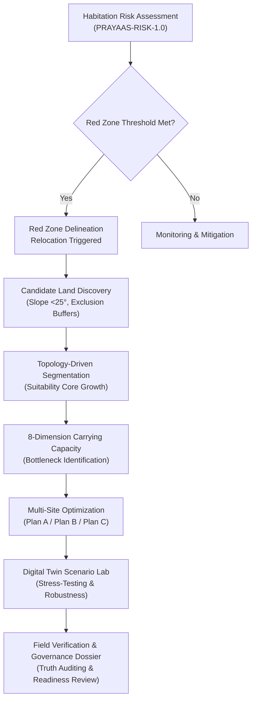

# PRAYAAS

**Intelligent GIS-Enabled Decision-Support Platform for Multi-Hazard Disaster Intelligence & Resilient Relocation Planning**

PRAYAAS is a hybrid geospatial decision-support platform designed for disaster management authorities (such as SDMAs and DDMAs) operating in vulnerable Himalayan terrain. It dynamically evaluates habitation risk, delineates multi-hazard Red Zones, automates the discovery and terrain segmentation of preliminary candidate relocation parcels, models multi-dimensional carrying capacity bottlenecks, optimizes household relocation allocations, and subjects relocation plans to Digital Twin scenario stress-testing.

---

## 1. Problem

Himalayan communities face escalating compound hazards—including landslides, flash floods, glacial lake outburst floods (GLOF), seismic activity, and slope destabilization (as seen in Chamoli 2021 and Joshimath 2023). Existing disaster management workflows often suffer from:
- Fragmented, static hazard maps that fail to synthesize compound risk.
- Subjective or ad-hoc identification of relocation sites without topographic slope or infrastructure feasibility checks.
- Lack of carrying-capacity modeling for receiving habitations, leading to unpredicted infrastructure failure under relocation influx.
- Opaque decision-making without auditable evidence provenance or resilience stress-testing.

---

## 2. What PRAYAAS Does

PRAYAAS provides a unified, scientifically rigorous decision framework:
- **Multi-Hazard Risk Engine (`PRAYAAS-RISK-1.0`)**: Computes deterministic composite risk scores across multiple hazard layers using multi-criteria decision analysis (AHP).
- **Statutory Red-Zone Delineation**: Identifies habitations and zones unsuitable for permanent human habitation based on critical hazard thresholds.
- **Automated Candidate Land Discovery**: Discovers contiguous candidate reception parcels from Digital Elevation Models (DEM), enforcing slope guards (<25°), distance thresholds, and statutory buffer exclusions.
- **Natural Topology Segmentation**: Partitions large contiguous areas using suitability cores and terrain topology rather than arbitrary area cutoffs.
- **8-Dimension Carrying Capacity Assessment**: Evaluates receiving sites across Housing, Water, Sanitation, Healthcare, Education, Transport, Utilities, and Environment.
- **Multi-Site Relocation Optimization**: Uses mixed-integer linear programming (MILP) to generate Pareto-optimal allocation strategies (Plan A: Minimum Distance, Plan B: Minimum Site Count, Plan C: Balanced Allocation).
- **Digital Twin & Scenario Stress Lab**: Simulates climate, operational, and infrastructure shocks (Water Stress, Population Surge, Road Outage, Destination Site Outage, Infrastructure Upgrade) to test plan robustness.
- **Governance & Field Evidence Ledger**: Tracks field inspections, ground-truthing evidence, and community consent before any relocation plan can be certified for execution.

---

## 3. Core Workflow



---

## 4. Key Differentiators

- **Data-Honesty Architecture**: Every single data point and capacity metric is explicitly tagged with an evidence provenance mode: `OBSERVED`, `PUBLIC_VERIFIED`, `MODELED`, `PLANNING_ASSUMPTION`, `DEMO`, or `UNKNOWN`.
- **Critical Unknown Protection**: The platform strictly prevents false-positive safety certifications (`PASS`) in both Readiness Assessment and Digital Twin stress tests whenever critical service dimensions are unmeasured.
- **Topology-Driven Land Segmentation**: Avoids cookie-cutter parcel boundaries by allowing natural region growth guided by suitability topology, competition between cores, and physical terrain constraints.
- **Full-Stack Geodesic Precision**: Uses PostGIS native spatial types (`EPSG:4326`) and geodesic distance/area calculations compliant with RFC 7946 GeoJSON standards (`[longitude, latitude]`).

---

## 5. Current Implementation Status

- **Backend Test Suite**: **133 passed**, 0 failed (100% passing across spatial, risk, discovery, segmentation, carrying capacity, optimization, digital twin, and governance modules).
- **Frontend Production Build**: **PASS** (Zero TypeScript errors, Vite production bundle generated).
- **Frozen Benchmark Run (Raini / Chamoli)**:
  - Origin Habitation: Raini (`HAB-002`), Target Relocation Population: 1,256.
  - Candidate Discovery Run: `CDR-8E12008ADCC0` (182 preliminary candidate reception parcels modeled).
  - Relocation Plans:
    - **Plan A (Min Distance)**: 1,256 allocated to `PARCEL-5958B764DA60` (0.46 km, 83.7% utilization).
    - **Plan B (Min Site Count)**: 1,256 allocated to `PARCEL-5958B764DA60` (0.46 km, 83.7% utilization).
    - **Plan C (Balanced)**: Multi-site allocation across `PARCEL-E3247A11E0EC` (150 allocated) and `PARCEL-287BBE825053` (1,106 allocated), average distance 8.89 km.
  - Digital Twin Robustness: 6 scenarios evaluated, 4 failures under stress (Water, Education, Transport, Candidate Outage), 2 marked `UNKNOWN` due to unmeasured critical dimensions (Sanitation, Healthcare, Utilities).

---

## 6. Tech Stack

### Frontend
- **Framework**: React 19 + TypeScript + Vite
- **Styling**: Tailwind CSS v4
- **Mapping & GIS**: Leaflet, React-Leaflet
- **Icons & UI**: Lucide React

### Backend
- **Framework**: FastAPI (Python 3.12+) + Pydantic v2
- **ORM & Database Tooling**: SQLAlchemy 2.0, GeoAlchemy2, Alembic
- **Optimization & Spatial Math**: SciPy `milp` (HiGHS), NumPy, Shapely
- **Database Driver**: `psycopg` (v3 binary)

### Database
- **Engine**: PostgreSQL 16 + PostGIS 3.4 (`postgis/postgis:16-3.4-alpine`)

---

## 7. Local Setup

### Prerequisites
- Python 3.12+
- Node.js 20+ and npm
- PostgreSQL 16 with PostGIS 3.4 extension enabled

### Backend Setup

```bash
# 1. Navigate to backend directory
cd backend

# 2. Create and activate a Python virtual environment
python -m venv .venv
# On Windows:
.venv\Scripts\activate
# On Linux/macOS:
source .venv/bin/activate

# 3. Install dependencies
pip install -e .
pip install -e ".[dev]"

# 4. Configure environment
cp .env.example .env
# Edit .env to set your local PostgreSQL credentials

# 5. Run database migrations
alembic upgrade head

# 6. Seed initial benchmark data (Chamoli district)
python -m app.seeds.seed_chamoli

# 7. Start FastAPI development server
python -m uvicorn app.main:app --host 127.0.0.1 --port 8000 --reload
```

Interactive OpenAPI Swagger UI will be available at:
- `http://localhost:8000/docs`

### Frontend Setup

```bash
# From repository root
npm install

# Start Vite development server
npm run dev

# Run TypeScript typecheck and production build
npm run build
```

Frontend application will be accessible at `http://localhost:5173`.

---

## 8. Docker Setup

To launch the complete PostgreSQL + PostGIS database container:

```bash
# Start PostGIS database
docker compose up -d

# Check database container status
docker compose ps
```

---

## 9. Running Tests

Run the complete backend test suite:

```bash
cd backend
python -m pytest -v
```

Expected result:
```
133 passed in ~130s
```

Run frontend typecheck and build validation:

```bash
npm run build
```

---

## 10. Data Honesty & Limitations

To ensure absolute scientific and public-policy honesty, the following constraints and statuses are explicitly stated:

### AI & Hazard Modeling Status
- **Random Forest Landslide Susceptibility**: Currently marked **`UNTRAINED / INSUFFICIENT_REAL_DATA`**. Because verified landslide inventory events are not yet linked to spatial features in the local study corridor, the Random Forest model is not deployed for operational risk decisions.
- **Frequency Ratio (FR)**: Marked **`DEMO / NOT VALIDATED`** for benchmark comparison only.
- **Analytical Hierarchy Process (AHP)**: Fully **`CONFIGURED / CONSISTENT`** with verified Consistency Ratio ($CR = 0.041 < 0.10$).
- **Multi-Model Agreement**: Marked **`UNKNOWN`** pending verified regional inventory training.

### Operational Scope & Wording
- **Preliminary Candidate Reception Parcels**: Discovered parcels are computational candidates derived from terrain slope and exclusion criteria. They are **not** certified "safe sites" and cannot be designated as such without mandatory field verification, geological borehole testing, and statutory clearances.
- **Government Feeds**: Telemetry endpoints for agencies (such as GSI, ISRO, and USDMA) operate on structured benchmark feeds and demonstration schemas; they do not represent live statutory API integrations.
- **Carrying Capacity**: Infrastructure capacities reflect planning assumptions and modeled figures. Critical unmeasured services (Sanitation, Healthcare, Utilities) require on-ground engineering audits before statutory relocation execution.

---

## 11. Project Structure

```
PRAYAAS/
├── backend/
│   ├── alembic/                 # Database migrations (001 through 008)
│   ├── app/
│   │   ├── api/v1/              # FastAPI endpoints (risk, discovery, optimization, digital twin, governance)
│   │   ├── core/                # Core utilities
│   │   ├── models/              # SQLAlchemy & GeoAlchemy2 models
│   │   ├── schemas/             # Pydantic validation schemas
│   │   ├── seeds/               # Deterministic benchmark seed data
│   │   ├── services/            # Domain analytical engines
│   │   │   ├── candidates/      # Land discovery & terrain segmentation
│   │   │   ├── demo_freeze/     # Frozen benchmark snapshot engine
│   │   │   ├── digital_twin/    # Digital twin & scenario lab engine
│   │   │   ├── document_ai/     # Optional document evidence extraction
│   │   │   ├── dossier/         # Decision dossier compilation
│   │   │   ├── governance/      # Evidence ledger & readiness reviews
│   │   │   ├── hazard_models/   # AHP, FR, and ML susceptibility models
│   │   │   ├── mcda/            # Multi-criteria decision analysis
│   │   │   ├── optimization/    # Multi-site relocation MILP engine
│   │   │   ├── relocation/      # Relocation readiness assessment
│   │   │   ├── risk/            # PRAYAAS-RISK-1.0 engine
│   │   │   ├── satellite/       # Satellite change detection simulation
│   │   │   ├── spatial/         # Geodesic & raster utilities
│   │   │   └── terrain/         # DEM slope & elevation processing
│   │   └── config.py            # Pydantic-settings configuration
│   ├── tests/                   # Pytest test suite (133 tests)
│   ├── pyproject.toml           # Python package & dependency metadata
│   └── .env.example             # Backend environment variable template
├── src/                         # React frontend application
│   ├── components/              # Command centre map, drawer, inspector
│   ├── pages/                   # Workstation pages (Dashboard, Risk, Relocation, Digital Twin)
│   ├── data/                    # Benchmark mock and fallback datasets
│   └── types/                   # TypeScript interfaces
├── docker-compose.yml           # Docker Compose definition for PostGIS
├── .env.example                 # Root environment variable template
└── README.md                    # Project documentation
```

---

## 12. Screenshots

Verified presentation and evaluation screenshots are archived in [`artifacts/prayaas_presentation_screenshots/`](artifacts/prayaas_presentation_screenshots/):
- `01_command_centre.png`: Main GIS Command Centre workstation with Chamoli catchment and active layer drawer.
- `02_raini_assessment.png`: Multi-hazard risk assessment for Raini (`HAB-002`, Permanent Red, 87.0 composite risk).
- `03_candidate_discovery_map.png`: Candidate discovery feasible mask (slope $\le 25^\circ$) with modeled candidate parcels.
- `04_candidate_detail.png`: Candidate inspection for Chamoli Town Extension (`RS-002`, 78/100 suitability, 6,200 capacity).
- `05_candidate_sites_inventory.png`: Candidate relocation sites inventory table with spatial parameters.
- `07_relocation_priority_matrix.png`: Relocation priority matrix with 13 red-zone settlements.
- `08_scenario_lab_workspace.png`: Multi-hazard scenario lab parametric stress workspace.
- `09_digital_twin_3d_workspace.png`: 3D Digital Twin simulation workspace.
- `10_evidence_layers_pipeline.png`: Scientific data pipeline and telemetry evidence feeds.

---

## 13. License & Data Notice

- **Project Status**: Developed for the Smart India Hackathon 2026 (Problem Statement SIH26191).
- **License**: License to be finalized.
- **Third-Party Data Notice**: All external reference datasets (including DEM, CartoDEM, OpenStreetMap features, and administrative boundaries) retain their respective original terms of use, licensing, and attribution.
